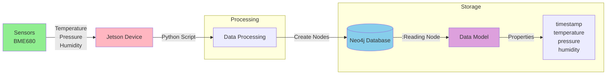

# Jetson Sensors Data Collection

This project collects sensor data (temperature, pressure, and humidity) from BME680 sensors and stores it in a Neo4j graph database. It's designed for NVIDIA Jetson devices but includes a simulation mode for testing.

## System Architecture



## Features

- Real-time sensor data collection from BME680
- Simulation mode for testing
- Neo4j graph database integration
- Configurable sampling rate
- Data ranges:
  - Temperature: 20-30°C
  - Pressure: 980-1020 hPa
  - Humidity: 30-70%

## Prerequisites

- NVIDIA Jetson device (or any system for simulation)
- Python 3.8+
- Neo4j Database
- BME680 sensor (for real data collection)

## Hardware Setup

### BME680 Connection
- VCC → 3.3V
- GND → Ground
- SCL → I2C SCL
- SDA → I2C SDA

## Installation

1. Clone the repository:
   ```bash
   git clone https://github.com/ajeetraina/jetson-sensors.git
   cd jetson-sensors
   ```

2. Install required packages:
   ```bash
   pip install -r requirements.txt
   ```

3. Configure Neo4j connection in `.env`:
   ```env
   NEO4J_URI=neo4j://localhost:7687
   NEO4J_USER=neo4j
   NEO4J_PASSWORD=your_password
   ```

## Usage

### Simulation Mode
```bash
python sensor_simulator.py
```

### Real Sensor Mode
```bash
python sensor_collector.py
```

## Data Model

Each reading is stored as a node with label `:Reading` and properties:
```cypher
CREATE (r:Reading {
    timestamp: datetime(),
    temperature: float,
    pressure: float,
    humidity: float
})
```

## Query Examples

### Latest Readings
```cypher
MATCH (r:Reading)
RETURN r.timestamp as time, 
       r.temperature as temp, 
       r.pressure as pressure,
       r.humidity as humidity
ORDER BY r.timestamp DESC
LIMIT 10
```

### Average Values
```cypher
MATCH (r:Reading)
WHERE r.timestamp > datetime() - duration('PT24H')
RETURN 
    avg(r.temperature) as avg_temp,
    avg(r.pressure) as avg_pressure,
    avg(r.humidity) as avg_humidity
```

### Temperature Trends
```cypher
MATCH (r:Reading)
WITH r.timestamp.hour as hour, avg(r.temperature) as avg_temp
RETURN hour, avg_temp
ORDER BY hour
```

## Contributing

1. Fork the repository
2. Create your feature branch
3. Commit your changes
4. Push to the branch
5. Create a new Pull Request

## License

MIT License
